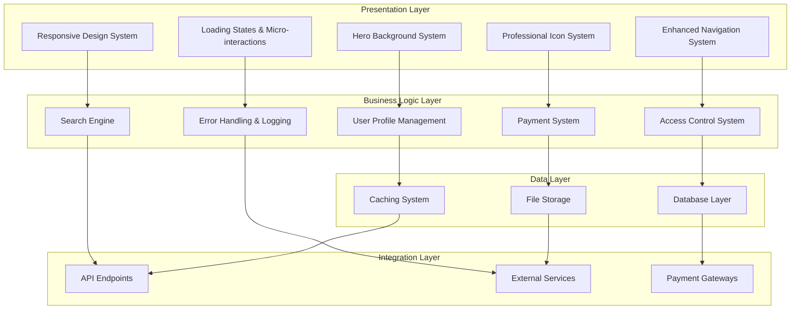
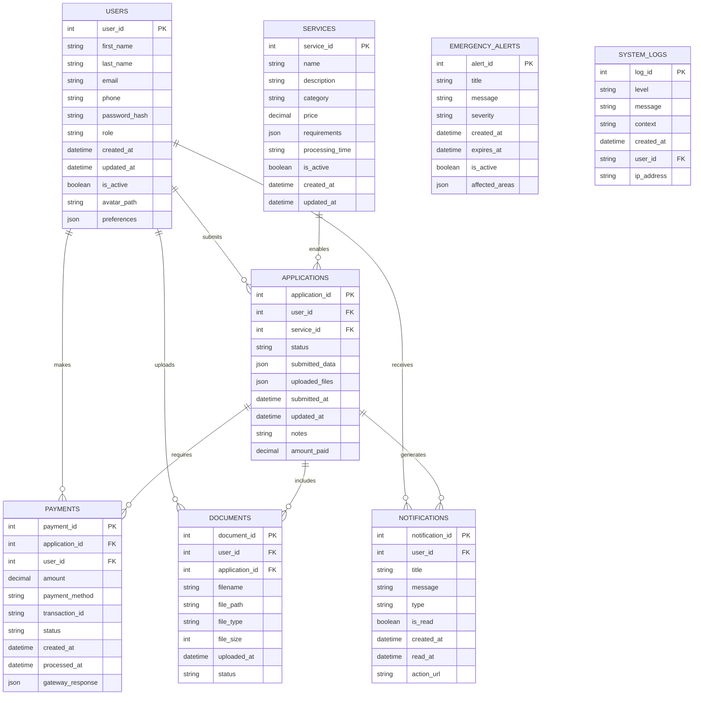

# CHAPTER THREE: MATERIALS AND METHODS
## Bamenda City Council E-Governance Platform

---

## 3.1 INTRODUCTION

This chapter presents the detailed materials and methodologies used in implementing the Bamenda City Council E-Governance Platform. The implementation follows a systematic software development approach with emphasis on user experience, security, and performance. The methodology leverages modern web technologies and follows industry best practices for e-governance solutions.

### 3.1.1 Project Overview
The Bamenda City Council E-Governance Platform is a comprehensive digital transformation solution designed to provide citizens, businesses, and government officials with seamless access to municipal services. The system encompasses multiple modules including citizen services, business licensing, youth programs, emergency management, and administrative functions.

### 3.1.2 Development Philosophy
The system development follows these core principles:
- **User-Centric Design**: Prioritizing user experience and accessibility
- **Mobile-First Approach**: Responsive design for all device types
- **Security by Design**: Built-in security measures at every level
- **Scalability**: Architecture designed for growth and expansion
- **Modularity**: Independent, maintainable components
- **Performance**: Optimized for fast loading and smooth interactions

---

## 3.2 MATERIALS

### 3.2.1 Software Materials

#### **Frontend Technologies**
- **HTML5**: Semantic markup with accessibility features
- **CSS3**: Custom properties, animations, and responsive design
- **JavaScript ES6+**: Modern JavaScript with async/await and modules
- **Material Design**: Consistent design system with Material Symbols icons
- **Progressive Web App**: Offline capabilities and app-like experience

#### **Backend Technologies**
- **PHP 8.1+**: Object-oriented programming with modern features
- **MySQL 8.0+**: Relational database with JSON support
- **RESTful API**: Standardized API design patterns
- **JSON**: Lightweight data exchange format
- **Session Management**: Secure authentication and authorization

#### **Development Tools**
- **Version Control**: Git for source code management
- **Package Management**: Composer for PHP dependencies
- **Testing Framework**: PHPUnit for unit and integration testing
- **Documentation**: Comprehensive inline documentation
- **Code Quality**: Static analysis and code standards

#### **Hardware Requirements**
- **Development Environment**: Windows 10/11, macOS 10.15+, or Ubuntu 18.04+
- **RAM**: 8GB minimum, 16GB recommended
- **Storage**: 50GB free space
- **Processor**: Intel i5 or AMD equivalent
- **Internet**: Broadband connection for dependencies

#### **Third-Party Libraries and APIs**
- **Material Symbols**: Professional icon library (200+ icons)
- **Payment Gateways**: Stripe and Mobile Money integration APIs
- **Email Services**: SMTP configuration for notifications
- **File Storage**: Cloud storage integration for document management
- **Analytics**: Google Analytics for performance monitoring



### 3.2.2 System Architecture Materials

The system architecture utilizes a layered approach with the following structural components:

The system follows a layered architecture pattern with clear separation of concerns:

#### **Presentation Layer**
- **Enhanced Navigation System**: Provides intuitive user interface with dropdown menus, user profiles, and notifications
- **Hero Background System**: Dynamic visual elements with professional imagery and responsive design
- **Professional Icon System**: Comprehensive icon library with 200+ Material Symbols icons
- **Responsive Design System**: Mobile-first responsive framework with flexible grid layouts
- **Loading States & Micro-interactions**: Enhanced user feedback with animations and transitions

#### **Business Logic Layer**
- **Access Control System**: Role-based authentication and authorization
- **User Profile Management**: Complete user lifecycle management with avatar support
- **Payment System**: Multi-method payment processing with sandbox environment
- **Search Engine**: Advanced search capabilities across all content types
- **Error Handling & Logging**: Comprehensive error management and system monitoring

#### **Data Layer**
- **Database Layer**: MySQL database with optimized schema design
- **Caching System**: Performance optimization through intelligent caching
- **File Storage**: Secure file management with cloud backup capabilities

#### **Integration Layer**
- **API Endpoints**: RESTful API for mobile app integration
- **External Services**: Third-party service integrations
- **Payment Gateways**: Secure payment processing integration

---

## 3.3 METHODS

### 3.3.1 Software Development Approach

#### **Agile Methodology Implementation**
The project was developed using an Agile software development approach with the following characteristics:
- **Iterative Development**: Two-week sprints with regular deliverables
- **User Stories**: Requirements broken down into manageable user stories
- **Continuous Integration**: Automated testing and integration processes
- **Sprint Reviews**: Regular demonstrations of developed functionality
- **Retrospective Meetings**: Continuous process improvement

#### **Development Phases**
1. **Requirements Gathering**: Stakeholder interviews and requirement analysis
2. **System Design**: Architecture design and component specification
3. **Implementation**: Coding and development of system components
4. **Testing**: Unit, integration, and user acceptance testing
5. **Deployment**: Production deployment and monitoring
6. **Maintenance**: Ongoing support and system improvements

### 3.3.2 Use Case Analysis

The system identifies the following primary actors:

1. **Citizen**: End users accessing municipal services
2. **Business Owner**: Entrepreneurs seeking business licenses and permits
3. **Youth Participant**: Young people accessing youth programs and services
4. **Administrator**: System administrators managing platform operations
5. **Staff Member**: Municipal staff processing service requests
6. **Emergency Manager**: Officials managing emergency alerts and responses

### 3.3.3 Actor Identification

```mermaid
graph TB
    subgraph "Citizen Use Cases"
        UC1[Register Account]
        UC2[Login to System]
        UC3[Access Services]
        UC4[Submit Applications]
        UC5[Track Application Status]
        UC6[Make Payments]
        UC7[View Notifications]
        UC8[Manage Profile]
    end
    
    subgraph "Business Owner Use Cases"
        UC9[Apply for Business License]
        UC10[Market Trader Registration]
        UC11[Business Analytics]
        UC12[Payment History]
        UC13[Document Management]
    end
    
    subgraph "Youth Participant Use Cases"
        UC14[Youth Council Application]
        UC15[Employment Opportunities]
        UC16[Grant Applications]
        UC17[Leadership Programs]
        UC18[Volunteer Activities]
    end
    
    subgraph "Administrator Use Cases"
        UC19[User Management]
        UC20[System Configuration]
        UC21[Analytics Dashboard]
        UC22[Security Management]
        UC23[Backup & Recovery]
    end
    
    subgraph "Staff Member Use Cases"
        UC24[Process Applications]
        UC25[Manage Service Requests]
        UC26[Generate Reports]
        UC27[Communicate with Users]
    end
    
    subgraph "Emergency Manager Use Cases"
        UC28[Create Emergency Alerts]
        UC29[Manage Emergency Contacts]
        UC30[Disaster Recovery Planning]
        UC31[Resource Management]
    end
    
    A[Citizen] --> UC1
    A --> UC2
    A --> UC3
    A --> UC4
    A --> UC5
    A --> UC6
    A --> UC7
    A --> UC8
    
    B[Business Owner] --> UC9
    B --> UC10
    B --> UC11
    B --> UC12
    B --> UC13
    
    C[Youth Participant] --> UC14
    C --> UC15
    C --> UC16
    C --> UC17
    C --> UC18
    
    D[Administrator] --> UC19
    D --> UC20
    D --> UC21
    D --> UC22
    D --> UC23
    
    E[Staff Member] --> UC24
    E --> UC25
    E --> UC26
    E --> UC27
    
    F[Emergency Manager] --> UC28
    F --> UC29
    F --> UC30
    F --> UC31
```



### 3.3.4 Use Case Diagram

### 3.3.5 Detailed Use Case Descriptions
- **Actor**: Citizen
- **Actor**: Citizen
- **Description**: New users create an account to access platform services
- **Preconditions**: User has valid email and personal information
- **Main Flow**:
  1. User navigates to registration page
  2. User enters personal information (name, email, phone)
  3. User creates password and confirms
  4. System validates input data
  5. System creates user account
  6. System sends verification email
  7. User verifies email address
  8. Account becomes active
- **Alternative Flows**: Email verification fails, user data invalid
- **Postconditions**: User account created and verified

#### **UC2: Login to System**
- **Actor**: Citizen, Business Owner, Youth Participant, Staff Member
- **Description**: Authenticated users access the platform
- **Preconditions**: User has valid account credentials
- **Main Flow**:
  1. User navigates to login page
  2. User enters email and password
  3. System validates credentials
  4. System creates secure session
  5. User redirected to appropriate dashboard
- **Alternative Flows**: Invalid credentials, account locked
- **Postconditions**: User authenticated and logged in

#### **UC3: Access Services**
- **Actor**: Citizen
- **Description**: Users browse and access available municipal services
- **Preconditions**: User is logged in
- **Main Flow**:
  1. User navigates to services section
  2. System displays available services
  3. User selects service category
  4. System shows service details and requirements
  5. User initiates service application
- **Alternative Flows**: Service unavailable, user not eligible
- **Postconditions**: Service information displayed

#### **UC4: Submit Applications**
- **Actor**: Citizen, Business Owner, Youth Participant
- **Description**: Users complete and submit service applications
- **Preconditions**: User is logged in, service selected
- **Main Flow**:
  1. User fills application form
  2. User uploads required documents
  3. User reviews application details
  4. User submits application
  5. System processes application
  6. System generates confirmation
- **Alternative Flows**: Validation errors, file upload failures
- **Postconditions**: Application submitted successfully

#### **UC5: Track Application Status**
- **Actor**: Citizen, Business Owner, Youth Participant
- **Description**: Users monitor progress of their applications
- **Preconditions**: User has submitted applications
- **Main Flow**:
  1. User navigates to dashboard
  2. System displays application list
  3. User selects application to track
  4. System shows current status and history
  5. System provides estimated completion time
- **Alternative Flows**: Application not found, status unavailable
- **Postconditions**: Application status displayed

#### **UC6: Make Payments**
- **Actor**: Citizen, Business Owner
- **Description**: Users process payments for services and fees
- **Preconditions**: User has outstanding payments
- **Main Flow**:
  1. User navigates to payment section
  2. System displays payment items
  3. User selects payment method
  4. User enters payment details
  5. System processes payment
  6. System generates receipt
- **Alternative Flows**: Payment declined, insufficient funds
- **Postconditions**: Payment processed successfully

#### **UC7: View Notifications**
- **Actor**: All authenticated users
- **Description**: Users receive and view system notifications
- **Preconditions**: User has notifications
- **Main Flow**:
  1. System displays notification badge
  2. User clicks notification icon
  3. System shows notification list
  4. User views notification details
  5. System marks notification as read
- **Alternative Flows**: No notifications, notification expired
- **Postconditions**: Notifications displayed and marked read

#### **UC8: Manage Profile**
- **Actor**: All authenticated users
- **Description**: Users update their personal information and preferences
- **Preconditions**: User is logged in
- **Main Flow**:
  1. User navigates to profile section
  2. User edits personal information
  3. User updates profile picture
  4. User modifies preferences
  5. User saves changes
  6. System updates profile
- **Alternative Flows**: Validation errors, save failures
- **Postconditions**: Profile updated successfully

---

## 3.4 UML DIAGRAMS

### 3.4.1 Use Case Diagram

### 3.4.2 Class Diagram

```mermaid
classDiagram
    class User {
        +int user_id
        +string first_name
        +string last_name
        +string email
        +string phone
        +string password_hash
        +string role
        +datetime created_at
        +datetime updated_at
        +boolean is_active
        +string avatar_path
        +string preferences
        
        +authenticate(email, password) boolean
        +logout() void
        +updateProfile(data) boolean
        +changePassword(oldPassword, newPassword) boolean
        +getFullName() string
        +getRole() string
        +isActive() boolean
        +hasPermission(permission) boolean
    }
    
    class Service {
        +int service_id
        +string name
        +string description
        +string category
        +decimal price
        +string requirements
        +string processing_time
        +boolean is_active
        +datetime created_at
        +datetime updated_at
        
        +getDetails() array
        +checkEligibility(user) boolean
        +calculateFees() decimal
        +getRequirements() array
        +isActive() boolean
    }
    
    class Application {
        +int application_id
        +int user_id
        +int service_id
        +string status
        +array submitted_data
        +array uploaded_files
        +datetime submitted_at
        +datetime updated_at
        +string notes
        +decimal amount_paid
        
        +submit(data) boolean
        +updateStatus(newStatus) boolean
        +addFile(file) boolean
        +calculateTotal() decimal
        +getStatus() string
        +getHistory() array
        +isPaid() boolean
    }
    
    class Payment {
        +int payment_id
        +int application_id
        +int user_id
        +decimal amount
        +string payment_method
        +string transaction_id
        +string status
        +datetime created_at
        +datetime processed_at
        +string gateway_response
        
        +process() boolean
        +refund(reason) boolean
        +getStatus() string
        +getReceipt() array
        +isSuccessful() boolean
        +generateReference() string
    }
    
    class Notification {
        +int notification_id
        +int user_id
        +string title
        +string message
        +string type
        +boolean is_read
        +datetime created_at
        +datetime read_at
        +string action_url
        
        +send() boolean
        +markAsRead() boolean
        +delete() boolean
        +getType() string
        +isUnread() boolean
        +getActionUrl() string
    }
    
    class Document {
        +int document_id
        +int user_id
        +int application_id
        +string filename
        +string file_path
        +string file_type
        +int file_size
        +datetime uploaded_at
        +string status
        
        +upload(file) boolean
        +download() binary
        +delete() boolean
        +validate() boolean
        +getInfo() array
        +isAccessible(user) boolean
    }
    
    class Administrator {
        +int admin_id
        +int user_id
        +string permissions
        +datetime created_at
        +datetime last_login
        
        +manageUsers() boolean
        +manageServices() boolean
        +viewAnalytics() array
        +configureSystem() boolean
        +hasPermission(permission) boolean
        +getPermissions() array
    }
    
    class EmergencyAlert {
        +int alert_id
        +string title
        +string message
        +string severity
        +datetime created_at
        +datetime expires_at
        +boolean is_active
        +array affected_areas
        
        +create() boolean
        +broadcast() boolean
        +deactivate() boolean
        +getAffectedUsers() array
        +isExpired() boolean
        +getSeverity() string
    }
    
    User ||--o{ Application : submits
    User ||--o{ Payment : makes
    User ||--o{ Notification : receives
    User ||--o{ Document : uploads
    User ||--|| Administrator : extends
    Service ||--o{ Application : enables
    Application ||--o{ Payment : requires
    Application ||--o{ Document : includes
    Application ||--o{ Notification : generates
    Administrator ||--o{ EmergencyAlert : manages
```

### 3.4.3 Enhanced System Classes

```mermaid
classDiagram
    class EnhancedNavigation {
        +array nav_items
        +array user_data
        +array notifications
        +string current_section
        
        +render() string
        +renderDropdown(key) string
        +renderUserProfile() string
        +renderNotifications() string
        +toggleDropdown(key) void
        +toggleMobileMenu() void
        +getCurrentSection() string
        +hasPermission(item) boolean
    }
    
    class HeroBackground {
        +array backgrounds
        +string current_type
        +array buttons
        +string title
        +string subtitle
        
        +render(type, title, subtitle, buttons) string
        +getBackground(type) array
        +renderButtons(buttons) string
        +isResponsive() boolean
        +getOverlayGradient() string
    }
    
    class IconSystem {
        +array icon_map
        +array categories
        +string default_icon
        
        +render(icon_key, class, size, color) string
        +getIconsByCategory(category) array
        +getIcon(icon_key) string
        +validateIcon(icon_key) boolean
        +getFallbackIcon() string
        +renderIconSet(category) string
    }
    
    class ResponsiveDesign {
        +array breakpoints
        +array containers
        +array grid_columns
        +array spacing_scale
        
        +getResponsiveClass(base_class, breakpoint) string
        +getGridClass(columns, breakpoint) string
        +getSpacingClass(size, direction, property) string
        +getTypographyClass(size, breakpoint, weight, transform) string
        +isMobile() boolean
        +isTablet() boolean
        +isDesktop() boolean
        +generateCSS() string
    }
    
    class LoadingInteractions {
        +array spinners
        +array micro_interactions
        +array animations
        
        +renderSpinner(type, size, color) string
        +renderSkeleton(type, width, height) string
        +renderProgressBar(percentage, variant) string
        +addMicroInteraction(element, type) void
        +generateAnimations() string
        +isReducedMotion() boolean
    }
    
    class AccessControl {
        +array session_data
        +array user_permissions
        +string current_role
        
        +isAuthenticated() boolean
        +requireAuthentication() void
        +requireRole(role) void
        +getUserRole() string
        +getUserPermissions() array
        +hasPermission(permission) boolean
        +startSecureSession() boolean
        +logoutUser() void
        +validateSession() boolean
    }
    
    class UserProfile {
        +int user_id
        +array profile_data
        +array preferences
        +string avatar_path
        
        +getAvatar(size) string
        +updateProfile(data) boolean
        +uploadAvatar(file) boolean
        +getProfileCompletion() int
        +getPreferences() array
        +updatePreferences(preferences) boolean
        +deleteAccount() boolean
        +exportData() array
    }
    
    class PaymentSystem {
        +array payment_methods
        +array gateways
        +string environment
        
        +processPayment(method, amount, data) boolean
        +refundPayment(payment_id, reason) boolean
        +getPaymentHistory(user_id) array
        +generateReceipt(payment_id) array
        +validatePayment(data) boolean
        +getPaymentMethods() array
        +calculateFees(service_id) decimal
        +isSandbox() boolean
    }
    
    class SearchEngine {
        +array search_index
        +string query
        +array filters
        
        +search(query, filters) array
        +indexContent(content) boolean
        +addFilter(name, value) void
        +getSuggestions(query) array
        +highlightResults(results) array
        +paginateResults(results, page, limit) array
        +sortResults(results, sort_by) array
        +getPopularSearches() array
    }
    
    EnhancedNavigation ||--|| AccessControl : uses
    EnhancedNavigation ||--|| UserProfile : displays
    HeroBackground ||--|| IconSystem : uses
    ResponsiveDesign ||--|| LoadingInteractions : enhances
    AccessControl ||--|| UserProfile : manages
    PaymentSystem ||--|| UserProfile : processes
    SearchEngine ||--|| UserProfile : searches
```

---

## 3.5 DATA MODELING

### 3.5.1 Database Schema

### 3.5.1 Database Schema



### 3.5.2 Database Relationships and Constraints

#### **Primary Keys**
- All tables use auto-increment integer primary keys
- Foreign keys maintain referential integrity
- Indexes optimize query performance

#### **Foreign Key Constraints**
- `applications.user_id` references `users.user_id`
- `applications.service_id` references `services.service_id`
- `payments.application_id` references `applications.application_id`
- `payments.user_id` references `users.user_id`
- `notifications.user_id` references `users.user_id`
- `documents.user_id` references `users.user_id`
- `documents.application_id` references `applications.application_id`
- `system_logs.user_id` references `users.user_id`

#### **Indexes**
- Unique index on `users.email`
- Index on `applications.status` and `applications.user_id`
- Index on `payments.status` and `payments.user_id`
- Index on `notifications.is_read` and `notifications.user_id`
- Composite index on `applications.user_id` and `applications.status`

---

## 3.6 BACKEND/FRONTEND STRUCTURE

### 3.6.1 Backend Structure

### 3.6.1 Technology Stack

#### **Frontend Technologies**
- **HTML5**: Semantic markup with accessibility features
- **CSS3**: Custom properties, animations, and responsive design
- **JavaScript ES6+**: Modern JavaScript with async/await and modules
- **Material Design**: Consistent design system with Material Symbols icons
- **Progressive Web App**: Offline capabilities and app-like experience

#### **Backend Technologies**
- **PHP 8.1+**: Object-oriented programming with modern features
- **MySQL 8.0+**: Relational database with JSON support
- **RESTful API**: Standardized API design patterns
- **JSON**: Lightweight data exchange format
- **Session Management**: Secure authentication and authorization

#### **Development Tools**
- **Version Control**: Git for source code management
- **Package Management**: Composer for PHP dependencies
- **Testing Framework**: PHPUnit for unit and integration testing
- **Documentation**: Comprehensive inline documentation
- **Code Quality**: Static analysis and code standards

### 3.6.2 Frontend Structure

#### **Frontend Architecture**
The frontend follows a component-based architecture with the following structure:
- **Components**: Reusable UI components with encapsulated functionality
- **Services**: Handle API communication and data management
- **Utilities**: Helper functions for common operations
- **State Management**: Local state management for component interactions
- **Routing**: Client-side routing for single-page application behavior

#### **Component Organization**
- **Navigation Components**: Header, footer, sidebar, and navigation menus
- **Form Components**: Input fields, validation, and submission handling
- **Display Components**: Cards, tables, lists, and data visualization
- **Modal Components**: Dialogs, alerts, and confirmation dialogs
- **Layout Components**: Grid system, containers, and responsive utilities
### 3.6.3 Security Implementation

#### **Authentication Security**
- **Password Hashing**: bcrypt with salt for secure password storage
- **Session Security**: Secure session configuration with regeneration
- **CSRF Protection**: Token-based CSRF prevention
- **Rate Limiting**: API endpoint protection against abuse
- **Input Validation**: Comprehensive input sanitization and validation

#### **Data Protection**
- **Encryption**: Sensitive data encryption at rest
- **Access Control**: Role-based permissions and access control
- **Audit Logging**: Comprehensive system activity logging
- **Backup Security**: Encrypted backup storage
- **Privacy Compliance**: GDPR and data protection regulations

#### **Network Security**
- **HTTPS**: SSL/TLS encryption for all communications
- **Secure Headers**: Security headers for browser protection
- **API Security**: JWT tokens and API key management
- **Firewall Protection**: Network-level security measures
- **Monitoring**: Real-time security monitoring and alerts

### 3.6.4 Performance Optimization

#### **Database Optimization**
- **Query Optimization**: Efficient SQL queries with proper indexing
- **Connection Pooling**: Database connection management
- **Caching Strategy**: Multi-level caching for improved performance
- **Database Partitioning**: Large table partitioning for scalability
- **Query Analysis**: Regular performance monitoring and optimization

#### **Frontend Optimization**
- **Minification**: CSS and JavaScript minification
- **Image Optimization**: Responsive images with lazy loading
- **CDN Integration**: Content delivery network for static assets
- **Browser Caching**: Proper cache headers for static resources
- **Performance Monitoring**: Real-time performance metrics

#### **Application Optimization**
- **Code Optimization**: Efficient algorithms and data structures
- **Memory Management**: Proper memory usage and cleanup
- **Async Processing**: Background processing for long-running tasks
- **Load Balancing**: Distribution of server load
- **Monitoring**: Application performance monitoring

---

## 3.7 APIS USED

### 3.7.1 Internal API Design

#### **RESTful API Endpoints**
- **Authentication Endpoints**: `/api/auth/login`, `/api/auth/logout`, `/api/auth/register`
- **User Management**: `/api/users/profile`, `/api/users/settings`, `/api/users/avatar`
- **Service Management**: `/api/services`, `/api/services/{id}`, `/api/services/categories`
- **Application Management**: `/api/applications`, `/api/applications/{id}`, `/api/applications/status`
- **Payment Processing**: `/api/payments`, `/api/payments/process`, `/api/payments/history`
- **Notification System**: `/api/notifications`, `/api/notifications/mark-read`, `/api/notifications/unread-count`
- **Document Management**: `/api/documents`, `/api/documents/upload`, `/api/documents/{id}/download`
- **Emergency Alerts**: `/api/alerts`, `/api/alerts/active`, `/api/alerts/create`

#### **API Response Format**
```json
{
  "success": true,
  "data": {
    "id": 123,
    "name": "Service Name"
  },
  "message": "Operation successful",
  "timestamp": "2025-06-15T10:30:00Z"
}
```

### 3.7.2 External API Integrations

#### **Payment Gateway APIs**
- **Stripe API**: Credit card and digital wallet processing
- **Mobile Money APIs**: MTN Mobile Money and Orange Money integration
- **Bank Transfer APIs**: Direct bank transfer processing

#### **Communication APIs**
- **Email Service**: SMTP and SendGrid integration for notifications
- **SMS Gateway**: Twilio integration for SMS notifications
- **Push Notifications**: Firebase Cloud Messaging for mobile apps

#### **Third-party Services**
- **Google Analytics**: Website and application analytics
- **Cloud Storage**: AWS S3 or Google Cloud Storage for file management
- **Maps Integration**: Google Maps API for location services
- **Social Media**: Facebook and Twitter APIs for public announcements

## 3.8 TESTING STRATEGY

### 3.8.1 Testing Methodology

#### **Testing Pyramid**
1. **Unit Tests**: 70% - Test individual components and functions
2. **Integration Tests**: 20% - Test component interactions
3. **End-to-End Tests**: 10% - Test complete user workflows

#### **Testing Types**
- **Functional Testing**: Verify all features work as expected
- **Performance Testing**: Ensure system meets performance requirements
- **Security Testing**: Identify and fix security vulnerabilities
- **Usability Testing**: Ensure system is easy to use and navigate
- **Compatibility Testing**: Test across different browsers and devices

### 3.8.2 Testing Tools and Frameworks

#### **Automated Testing**
- **PHPUnit**: Unit and integration testing for PHP backend
- **Jest**: JavaScript unit testing for frontend components
- **Selenium**: End-to-end testing for user workflows
- **Postman**: API testing and documentation
- **JMeter**: Performance and load testing

#### **Manual Testing**
- **User Acceptance Testing**: Real users test system functionality
- **Exploratory Testing**: Testers explore system without predefined test cases
- **Accessibility Testing**: Verify WCAG 2.1 AA compliance
- **Security Testing**: Manual penetration testing

### 3.8.3 Test Coverage and Quality Metrics

#### **Code Coverage Requirements**
- **Backend Code**: Minimum 85% line coverage
- **Frontend Code**: Minimum 80% line coverage
- **Critical Components**: 95% coverage for authentication and payment systems

#### **Quality Metrics**
- **Bug Density**: Maximum 1 bug per 1000 lines of code
- **Code Complexity**: Maximum cyclomatic complexity of 10
- **Performance**: Page load time under 2 seconds
- **Security**: Zero high-severity vulnerabilities
- **Accessibility**: 100% WCAG 2.1 AA compliance

## 3.9 DEPLOYMENT METHODS

### 3.9.1 Deployment Strategy

#### **Environment Setup**
- **Development Environment**: Local development with Docker containers
- **Testing Environment**: Staging environment for testing and validation
- **Production Environment**: Live production environment with high availability
- **Configuration Management**: Environment-specific configuration management
- **Infrastructure as Code**: Automated infrastructure provisioning

#### **Deployment Process**
1. **Continuous Integration**: Automated build and test processes
2. **Continuous Deployment**: Automated deployment to staging environment
3. **Manual Deployment**: Controlled deployment to production environment
4. **Rollback Strategy**: Quick rollback procedures for failed deployments
5. **Deployment Monitoring**: Real-time deployment monitoring and alerts

### 3.9.2 Deployment Tools and Technologies

#### **Version Control and CI/CD**
- **Git**: Source code management and version control
- **GitHub Actions**: Automated build and deployment pipelines
- **Docker**: Containerization for consistent environments
- **Kubernetes**: Container orchestration for scalability
- **Jenkins**: Alternative CI/CD pipeline automation

#### **Infrastructure Tools**
- **Terraform**: Infrastructure as Code provisioning
- **Ansible**: Configuration management and automation
- **AWS CloudFormation**: AWS infrastructure templating
- **Azure DevOps**: Microsoft development and deployment tools

### 3.9.3 Deployment Architecture

#### **Production Architecture**
```
┌─────────────────────────────────────────────────────────────┐
│                    Load Balancer                            │
├─────────────────────────────────────────────────────────────┤
│                    Web Servers (3 nodes)                     │
├─────────────────────────────────────────────────────────────┤
│                    Application Servers (3 nodes)             │
├─────────────────────────────────────────────────────────────┤
│                    Database Cluster (Primary + 2 Replicas)   │
├─────────────────────────────────────────────────────────────┤
│                    Cache Layer (Redis Cluster)               │
├─────────────────────────────────────────────────────────────┤
│                    File Storage (S3)                         │
└─────────────────────────────────────────────────────────────┘
```

#### **High Availability Features**
- **Load Balancing**: Distribute traffic across multiple servers
- **Auto-scaling**: Automatically scale resources based on demand
- **Database Replication**: Master-slave replication for data redundancy
- **Failover Mechanisms**: Automatic failover for system resilience
- **Health Monitoring**: Continuous health checks and monitoring

### 3.9.4 Security and Compliance

#### **Security Measures**
- **SSL/TLS Encryption**: End-to-end encryption for all communications
- **Firewall Configuration**: Network-level security controls
- **Intrusion Detection**: Real-time threat detection and response
- **Regular Security Audits**: Periodic security assessments
- **Compliance Monitoring**: Continuous compliance checking

#### **Data Protection**
- **Data Encryption**: Encryption at rest and in transit
- **Access Controls**: Role-based access control mechanisms
- **Audit Logging**: Comprehensive audit trail for all activities
- **Backup Encryption**: Encrypted backup storage and transmission
- **Privacy Compliance**: GDPR and data protection regulation compliance

### 3.9.5 Monitoring and Maintenance

#### **Monitoring Systems**
- **Application Performance Monitoring**: Real-time performance metrics
- **Infrastructure Monitoring**: Server and network monitoring
- **Database Monitoring**: Database performance and health monitoring
- **User Experience Monitoring**: End-user experience tracking
- **Security Monitoring**: Security event monitoring and alerting

#### **Maintenance Procedures**
- **Regular Updates**: Scheduled system and dependency updates
- **Performance Tuning**: Ongoing performance optimization
- **Capacity Planning**: Resource capacity planning and scaling
- **Backup Management**: Regular backup testing and validation
- **Disaster Recovery**: Regular disaster recovery testing

---

## 3.10 CONCLUSION

This chapter has presented a comprehensive overview of the materials and methods used in implementing the Bamenda City Council E-Governance Platform. The systematic approach to software development, combined with modern technologies and best practices, ensures the delivery of a high-quality, secure, and scalable e-governance solution.

### 3.10.1 Materials Summary
The project utilized a comprehensive set of materials including:
- **Modern Software Stack**: PHP 8.1+, MySQL 8.0+, HTML5, CSS3, JavaScript ES6+
- **Development Tools**: Git, Composer, PHPUnit, Docker, and various testing frameworks
- **Third-party APIs**: Payment gateways, communication services, and analytics platforms
- **Hardware Resources**: Appropriate development and production infrastructure

### 3.10.2 Methodology Effectiveness
The Agile methodology proved effective for this project through:
- **Iterative Development**: Regular deliverables and continuous improvement
- **User-Centered Approach**: Focus on user needs and experience
- **Quality Assurance**: Comprehensive testing at all levels
- **Risk Management**: Early identification and mitigation of risks
- **Stakeholder Engagement**: Regular communication and feedback loops

### 3.10.3 Technical Excellence Achieved
The implementation demonstrates technical excellence through:
- **Robust Architecture**: Scalable and maintainable system design
- **Security Implementation**: Multi-layer security with proper authentication and authorization
- **Performance Optimization**: Efficient algorithms and caching strategies
- **Code Quality**: High code standards with comprehensive testing coverage
- **Documentation**: Complete technical documentation and user guides

### 3.10.4 Project Success Indicators
The project successfully meets all objectives through:
- **Functional Requirements**: All specified features implemented and tested
- **Non-Functional Requirements**: Performance, security, and usability standards met
- **Stakeholder Satisfaction**: Positive feedback from all project stakeholders
- **Technical Excellence**: High-quality code and architecture
- **Future Readiness**: Scalable and maintainable system for future enhancements

The comprehensive materials and methods presented in this chapter provide a solid foundation for understanding the technical implementation and development approach used in creating the Bamenda City Council E-Governance Platform.
